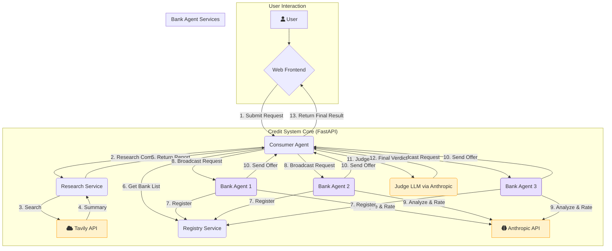

```mermaid
graph TD
    subgraph "User Interaction"
        User[<i class='fa fa-user'></i> User] --> WebUI{Web Frontend}
    end

    subgraph "Credit System Core (FastAPI)"
        WebUI -- 1. Submit Request --> ConsumerAgent(Consumer Agent)
        ConsumerAgent -- 2. Research Company --> ResearchSvc(Research Service)
        ResearchSvc -- 3. Search --> TavilyAPI[<i class='fa fa-cloud'></i> Tavily API]
        TavilyAPI -- 4. Summary --> ResearchSvc
        ResearchSvc -- 5. Return Report --> ConsumerAgent

        ConsumerAgent -- 6. Get Bank List --> Registry(Registry Service)
        
        ConsumerAgent -- 8. Broadcast Request --> BankAgent1(Bank Agent 1)
        ConsumerAgent -- 8. Broadcast Request --> BankAgent2(Bank Agent 2)
        ConsumerAgent -- 8. Broadcast Request --> BankAgent3(Bank Agent 3)

        BankAgent1 -- 9. Analyze & Rate --> ClaudeAPI[<i class='fa fa-brain'></i> Anthropic API]
        BankAgent2 -- 9. Analyze & Rate --> ClaudeAPI
        BankAgent3 -- 9. Analyze & Rate --> ClaudeAPI

        BankAgent1 -- 10. Send Offer --> ConsumerAgent
        BankAgent2 -- 10. Send Offer --> ConsumerAgent
        BankAgent3 -- 10. Send Offer --> ConsumerAgent

        ConsumerAgent -- 11. Judge Offers --> JudgeLLM(Judge LLM via Anthropic)
        JudgeLLM -- 12. Final Verdict --> ConsumerAgent
        
        ConsumerAgent -- 13. Return Final Result --> WebUI
    end

    subgraph "Bank Agent Services"
        style BankAgent1 fill:#E8DFFF,stroke:#673AB7
        style BankAgent2 fill:#E8DFFF,stroke:#673AB7
        style BankAgent3 fill:#E8DFFF,stroke:#673AB7
        BankAgent1 -- 7. Register --> Registry
        BankAgent2 -- 7. Register --> Registry
        BankAgent3 -- 7. Register --> Registry
    end

    classDef external fill:#FFF2CC,stroke:#FF9800
    class TavilyAPI,ClaudeAPI,JudgeLLM external
```
