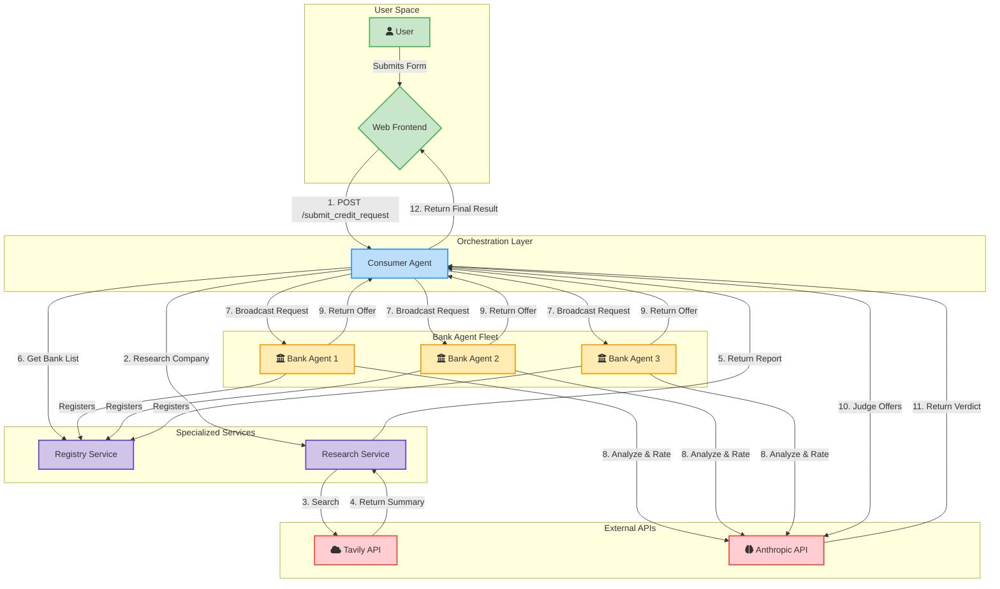

```mermaid
flowchart TD
    %% Define Styles
    classDef user fill:#C8E6C9,stroke:#4CAF50,stroke-width:2px;
    classDef orchestrator fill:#BBDEFB,stroke:#2196F3,stroke-width:2px;
    classDef service fill:#D1C4E9,stroke:#673AB7,stroke-width:2px;
    classDef agent fill:#FFECB3,stroke:#FF9800,stroke-width:2px;
    classDef external fill:#FFCDD2,stroke:#F44336,stroke-width:2px;

    %% User Space
    subgraph User Space
        User[<i class='fa fa-user'></i> User]:::user
        WebUI{Web Frontend}:::user
    end

    %% Orchestration Layer
    subgraph Orchestration Layer
        ConsumerAgent[Consumer Agent]:::orchestrator
    end

    %% Specialized Services
    subgraph Specialized Services
        Registry[Registry Service]:::service
        ResearchSvc[Research Service]:::service
    end
    
    %% Bank Agent Fleet
    subgraph Bank Agent Fleet
        BankAgent1[<i class='fa fa-university'></i> Bank Agent 1]:::agent
        BankAgent2[<i class='fa fa-university'></i> Bank Agent 2]:::agent
        BankAgent3[<i class='fa fa-university'></i> Bank Agent 3]:::agent
    end

    %% External APIs
    subgraph External APIs
        TavilyAPI[<i class='fa fa-cloud'></i> Tavily API]:::external
        ClaudeAPI[<i class='fa fa-brain'></i> Anthropic API]:::external
    end

    %% Define Flows
    User -- "Submits Form" --> WebUI
    WebUI -- "1. POST /submit_credit_request" --> ConsumerAgent
    
    ConsumerAgent -- "2. Research Company" --> ResearchSvc
    ResearchSvc -- "3. Search" --> TavilyAPI
    TavilyAPI -- "4. Return Summary" --> ResearchSvc
    ResearchSvc -- "5. Return Report" --> ConsumerAgent

    ConsumerAgent -- "6. Get Bank List" --> Registry
    BankAgent1 -- "Registers" --> Registry
    BankAgent2 -- "Registers" --> Registry
    BankAgent3 -- "Registers" --> Registry

    ConsumerAgent -- "7. Broadcast Request" --> BankAgent1
    ConsumerAgent -- "7. Broadcast Request" --> BankAgent2
    ConsumerAgent -- "7. Broadcast Request" --> BankAgent3

    BankAgent1 -- "8. Analyze & Rate" --> ClaudeAPI
    BankAgent2 -- "8. Analyze & Rate" --> ClaudeAPI
    BankAgent3 -- "8. Analyze & Rate" --> ClaudeAPI

    BankAgent1 -- "9. Return Offer" --> ConsumerAgent
    BankAgent2 -- "9. Return Offer" --> ConsumerAgent
    BankAgent3 -- "9. Return Offer" --> ConsumerAgent

    ConsumerAgent -- "10. Judge Offers" --> ClaudeAPI
    ClaudeAPI -- "11. Return Verdict" --> ConsumerAgent

    ConsumerAgent -- "12. Return Final Result" --> WebUI
```
